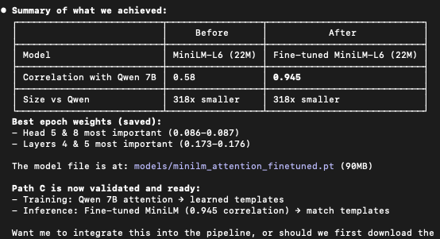

# Mycelium

Attention distillation for math word problem decomposition. Extract span structure from large models, use LLM with specialized templates at inference.

## The Insight

Transformer attention patterns reveal semantic spans. When processing "she sold half her eggs," attention weights show "half," "eggs," and "sold" attending to each other — the model recognizes this as a single operation (multiply by 0.5).

We extract these patterns from Qwen 7B, train a mapping to predict them from MiniLM features, then use an LLM with specialized templates at inference.

## ID Span Boundaries with Panama Hats Algorithm
- "panama" = country
- "panama hats" = a type of hat (completely different meaning)

We want the longest continuous sequence that retains attention connectivity. Naive tokenization breaks these into separate words and loses the semantic unit. The Panama Hats problem guides our span creation: we need the **longest span** that forms a cohesive operation.

## Attention Signals
Three signals extracted from attention matrices:

| Signal | What it measures | Use case |
|--------|------------------|----------|
| **Entropy** | Low = focused attention = important token | Find operators, key nouns |
| **Received** | High = many tokens look back here | Find entities, anchors |
| **Connectivity** | High = tokens form cohesive unit | Validate span boundaries |

Span to whole problem cross-attention guides sub-graph composition

## Why MiniLM is Perfect for Distillation
MiniLM was originally trained with: `loss = MSE(student_attention, teacher_attention)`

This means MiniLM already learned to mimic attention patterns from a larger teacher. When we fine-tune it on Qwen 7B attention patterns, it's doing exactly what it was designed for — just with a new teacher.

## Template Creation Pipeline

1. **Extract spans** — Panama Hats segmentation of GSM8K produces ~15k raw spans
2. **Qwen generalizes** — One-time GPU batch: names → `[ENTITY]`, numbers → `[N]`, structure preserved
3. **GROUP BY at 95% cosine similarity** — Cluster generalized spans by MiniLM embedding similarity → canonical span templates
4. **Custom sub-graph DSLs** — Frontier LLM creates custom sub-graph DSL representing the actual computation (not just SET/ADD/SUB)
5. **Embed templates** — MiniLM centroid embeddings for cosine matching at inference

## Iterative Generalization (Multi-Pass)

Raw spans have a long tail of singletons. One pass of generalization isn't enough — "Sally sold half her eggs at the farmer's market on Tuesday" and "He gave away a third of his cookies at school" should collapse to the same template, but lexical differences keep them apart.

**Solution: multiple passes, each targeting the singleton long tail.**

Each pass generates a **new column** — preserving the full audit trail. Non-singletons carry forward unchanged. Only small groups get re-generalized.

**After convergence:**
1. Embed final column with MiniLM
2. Cosine cluster at ~90% threshold → deduplicated templates
3. Generate SubGraphDSL (1:1) for each template

## Trained Signal Mapping (17k Spans)

We have 17k spans with BOTH MiniLM embeddings AND Qwen attention signals. This lets us train a mapping:

`MiniLM features → predicted Qwen signals`

**Fine-tuning process:**
- Extract Qwen 7B attention on 17k spans
- Cluster at 95% cosine sim → specialized span templates with custom DSL (sub-graph)
- Extract MiniLM embeddings on same 17k spans
- Train mapping: predict Qwen signals from MiniLM features ~95% correlation

## Cross-Attention Between Spans

Spans don't exist in isolation. We track:

1. **Sequence awareness** — Position in the problem (first span usually SET, later spans usually operations)
2. **Previous span tracking** — What operation came before? (context for current span)
3. **Entity tracking** — Which entities have been introduced? Which are being referenced?

Span to whole problem cross-attention guides sub-graph composition

## Template matching
Route by what operations DO, not what they SOUND LIKE.
A computation graph is a structural representation of what a DSL actually computes — parameter-agnostic, implementation-agnostic, operationally meaningful.

## Inference Pipeline

1. Run MiniLM (fast, 22M params)
2. Apply learned mapping → approximate Qwen signals
3. Use signals for span detection + template matching
4. LLM executes specialized template

No Qwen 7B needed at inference — just the trained mapping + LLM for execution.

## Specialized Templates with Sub-Graph DSLs (1:1)

Every deduplicated template has exactly one `SubGraphDSL` — its own composable sub-graph. Not flat labels (SET/ADD/SUB) but full computation graphs with typed ports:

- **params** — values extracted from the span text at inference (the `[N]` slots)
- **inputs** — values wired from upstream sub-graphs (resolved via cross-attention / entity tracking)
- **steps** — ordered computation. Operators: SET, ADD, SUB, MUL, DIV, MOD, NEG
- **output** — single value exposed to downstream sub-graphs

**Generic entities:**
GSM8K problems mention many entities (apples, cookies, cheese). Templates use `[PERSON1]`, `[ITEM1]`, `[N]` placeholders.

## Building the Graph (DAG Composition)

Sub-graphs compose into a **DAG** (not a tree). A tree can't handle convergence — "Tom has 5. Bob has 3. Together they have how many?" pulls from two upstream sub-graphs.

- **Match** span → template → get `SubGraphDSL` (with input/output ports)
- **Extract params** — LLM extracts `[N]` values from span text, guided by template pattern
- **Wire inputs** — cross-attention between spans determines which upstream output connects to which input port
- **Execute** — topological sort the DAG, run each sub-graph in order
- **Granularity** — Panama Hats: single output per sub-graph, segmentation enforces the right span boundaries

## Results

pending

## License

MIT — Bryce Roche ([github.com/bryceroche/mycelium](https://github.com/bryceroche/mycelium))

Built with [Claude Code](https://claude.ai/claude-code)
