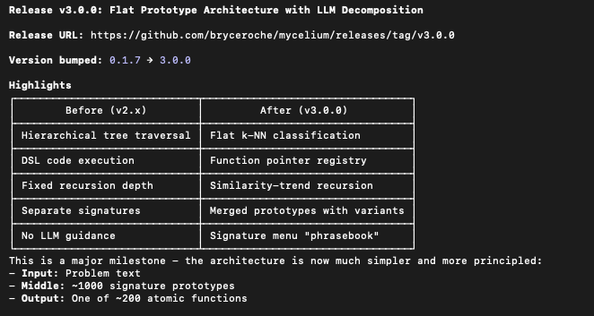

# Mycelium

**Decompose math problems into reusable atomic signatures.**

**[Read the Paper](https://drive.google.com/file/d/1Gn8Efk4F2GW1bT3qGlHmKV-V_C6hIaLk/view)**

First solve of a problem type is hard. Second solve is easier. 100th solve is trivial.

## v3.0.0: Flat Prototype Architecture



| Before (v2.x) | After (v3.0.0) |
|---------------|----------------|
| Hierarchical tree traversal | Flat k-NN classification |
| DSL code execution | Function pointer registry |
| Fixed recursion depth | Similarity-trend recursion |
| Separate signatures | Merged prototypes with variants |
| No LLM guidance | Signature menu "phrasebook" |

### The Three Components

```
Problem Text
     │
     ▼
┌─────────────────────────────────┐
│  LLM Decomposer                 │
│  (with signature menu)          │
└─────────────────────────────────┘
     │
     ▼ [atomic steps with func names]
┌─────────────────────────────────┐
│  Signature Store (k-NN)         │
│  ~1000 prototypes               │
└─────────────────────────────────┘
     │
     ▼ [best matching signature]
┌─────────────────────────────────┐
│  Function Registry              │
│  call_function(name, *args)     │
└─────────────────────────────────┘
     │
     ▼
   Result
```

- **LLM**: Recursive decomposition with signature examples as guidance
- **Tree**: Semantic → function mapping via k-NN classification
- **Python**: Deterministic execution via function registry (57-200 functions)


## Quick Start (~5 min)

```bash
git clone https://github.com/bryceroche/mycelium
cd mycelium
pip install -r requirements.txt

# Download pre-trained DB (13K signatures, 342MB compressed)
gh release download v1.4.0
gunzip mycelium.db.gz embedding_cache.db.gz

# Inference (just needs API key from Google AI Studio)
export GOOGLE_API_KEY=your_key
python scripts/pipeline_runner.py --dataset math --levels 1 2 --problems 20 --workers 4
```

**Requirements:** Python 3.11+, [Google API key](https://aistudio.google.com/apikey)

### Training Runs (GCP)

For large-scale training, use Vertex AI:

```bash
export MYCELIUM_PROVIDER=gcp
export GOOGLE_CLOUD_PROJECT=your_project
python scripts/pipeline_runner.py --dataset math --levels 1 2 3 4 5 --problems 500 --workers 8
```

Requires GCP project with Vertex AI enabled.

## Pre-trained Database

Download from [v1.4.0 release](https://github.com/bryceroche/mycelium/releases/tag/v1.4.0):

| File | Size | Contents |
|------|------|----------|
| `mycelium.db.gz` | 342 MB | 13,016 signatures (6,776 umbrellas, 6,240 leaves) |
| `embedding_cache.db.gz` | 25 MB | MathBERT embedding cache |

```bash
# Alternative: curl
curl -L https://github.com/bryceroche/mycelium/releases/download/v1.4.0/mycelium.db.gz | gunzip > mycelium.db
curl -L https://github.com/bryceroche/mycelium/releases/download/v1.4.0/embedding_cache.db.gz | gunzip > embedding_cache.db
```


## Stack

- **LLM (Training):** Gemini 2.5 Pro via Vertex AI
- **LLM (Inference):** Gemini 2.0 Flash (API key or Vertex AI)
- **Embeddings:** gemini-embedding-001 (3072 dimensions)
- **DB:** SQLite + WAL mode
- **Training Deployment:** Google Cloud VM

**Please read the [CLAUDE.md](CLAUDE.md) for the latest thinking.**

## License
MIT — Bryce Roche ([github.com/bryceroche/mycelium](https://github.com/bryceroche/mycelium))
Built with [Claude Code](https://claude.ai/claude-code)
