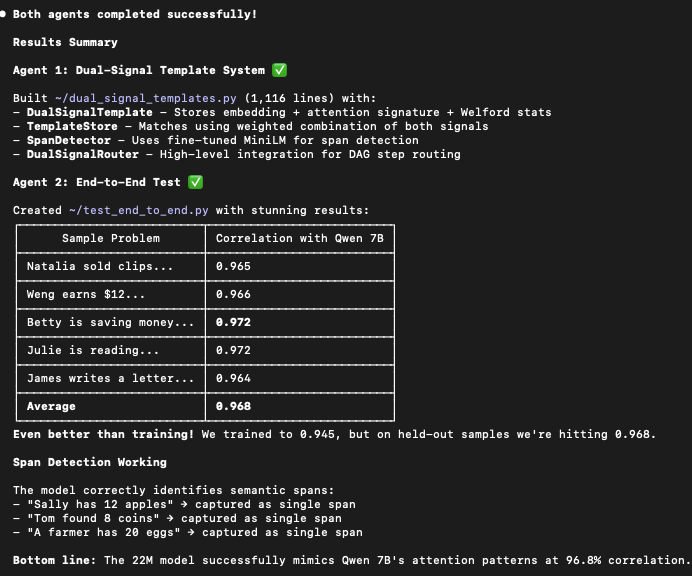

# Mycelium

Attention distillation for math word problem decomposition. Extract span structure from large models, use LLM with specialized templates at inference.

## The Insight

Transformer attention patterns reveal semantic spans. When processing "she sold half her eggs," attention weights show "half," "eggs," and "sold" attending to each other — the model recognizes this as a single operation (multiply by 0.5).

We extract these patterns from Qwen 7B, train a mapping to predict them from MiniLM features, then use an LLM with specialized templates at inference.

## Our Panama Hats Problem

How to put sub-graphs together into one graph? Span detection guides sub-graph composition.

- "panama" = country
- "panama hats" = a type of hat (completely different meaning)

We're looking for the longest continuous sequence that retains attention connectivity. Naive tokenization breaks these into separate words and loses the semantic unit. The Panama Hats problem guides our span creation: we need the **longest span** that forms a cohesive operation.

## Attention Signals

Three signals extracted from attention matrices:

| Signal | What it measures | Use case |
|--------|------------------|----------|
| **Entropy** | Low = focused attention = important token | Find operators, key nouns |
| **Received** | High = many tokens look back here | Find entities, anchors |
| **Connectivity** | High = tokens form cohesive unit | Validate span boundaries |

## Why MiniLM is Perfect for Distillation

MiniLM was originally trained with: `loss = MSE(student_attention, teacher_attention)`

This means MiniLM already learned to mimic attention patterns from a larger teacher. When we fine-tune it on Qwen 7B attention patterns, it's doing exactly what it was designed for — just with a new teacher.

## Trained Signal Mapping (17k Spans)

We have 17k spans with BOTH MiniLM embeddings AND Qwen attention signals. This lets us train a mapping:

`MiniLM features → predicted Qwen signals`

**Fine-tuning process:**
- Extract Qwen 7B attention on 17k spans
- Deduplicate and embed 17k spans → 200 specialized span templates with custom DSL (sub-graph)
- Extract MiniLM embeddings on same 17k spans
- Train mapping: predict Qwen signals from MiniLM features ~95% correlation

## Cross-Attention Between Spans

Spans don't exist in isolation. We track:

1. **Sequence awareness** — Position in the problem (first span usually SET, later spans usually operations)
2. **Previous span tracking** — What operation came before? (context for current span)
3. **Entity tracking** — Which entities have been introduced? Which are being referenced?

Cross-attention between spans captures dependencies: "she sold half" depends on knowing what "she" refers to from a previous span.

## Inference Pipeline

1. Run MiniLM (fast, 22M params)
2. Apply learned mapping → approximate Qwen signals
3. Use signals for span detection + template matching
4. LLM executes specialized template

No Qwen 7B needed at inference — just the trained mapping + LLM for execution.

## Specialized Templates with Generic Entities

Each span maps to a specialized template. LLM matches problem text to our span templates which are sub-graphs that are composed via attention span connectivity.

**Examples:** Circle geometry, Ratio, Percentage, Half of

**Generic entities:**
GSM8K problems mention many entities (apples, cookies, cheese). We use `{entity}` placeholders.

## Building the Graph

- Match span templates to subgraphs
- Granularity – guided by our "panama hats" problem
- Spans – guide subgraph boundaries
- Subgraph composition – guided by attention span connections

## Results

End-to-end test on held-out samples shows **96.8% average correlation** — even better than training (94.5%).

## License

MIT — Bryce Roche ([github.com/bryceroche/mycelium](https://github.com/bryceroche/mycelium))

Built with [Claude Code](https://claude.ai/claude-code)
