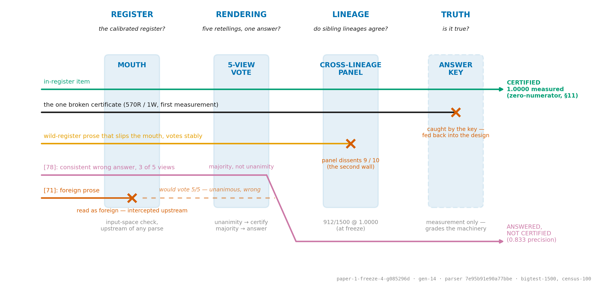
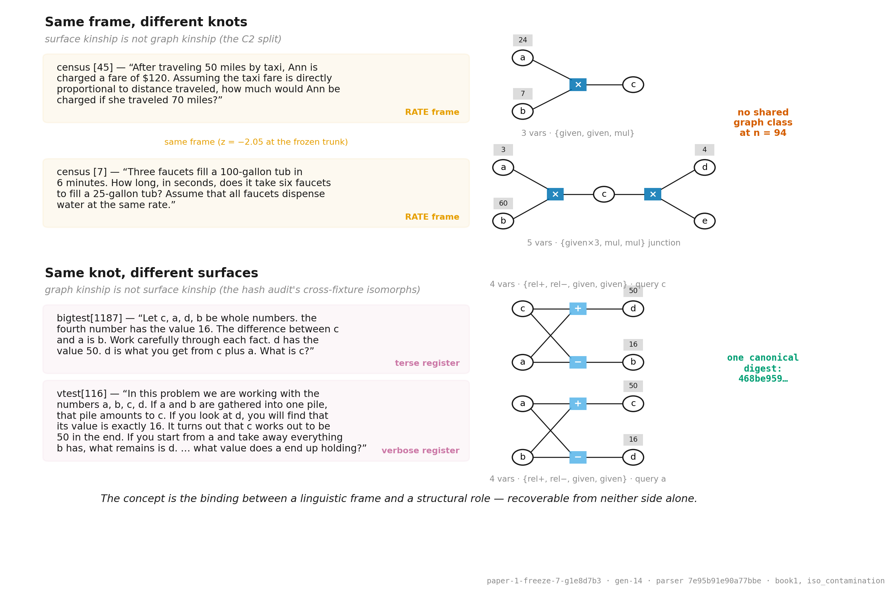
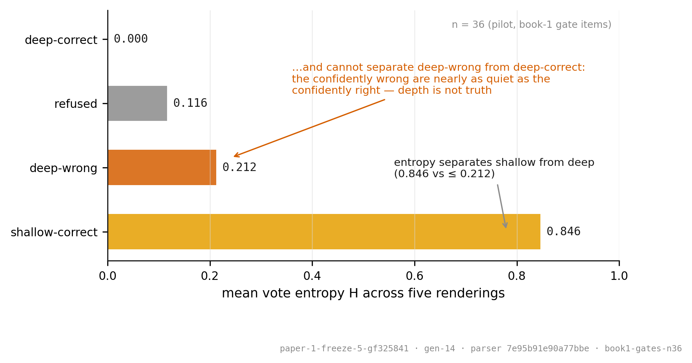
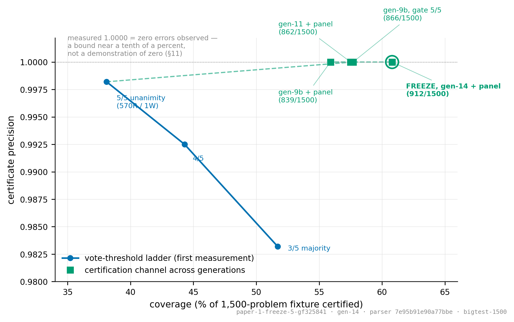
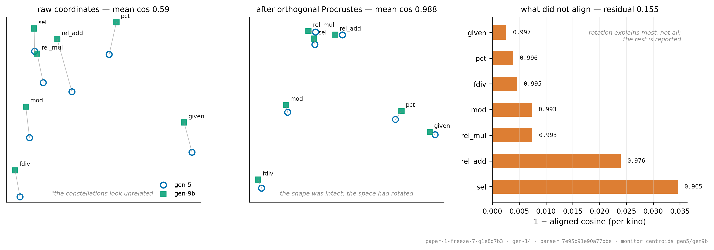
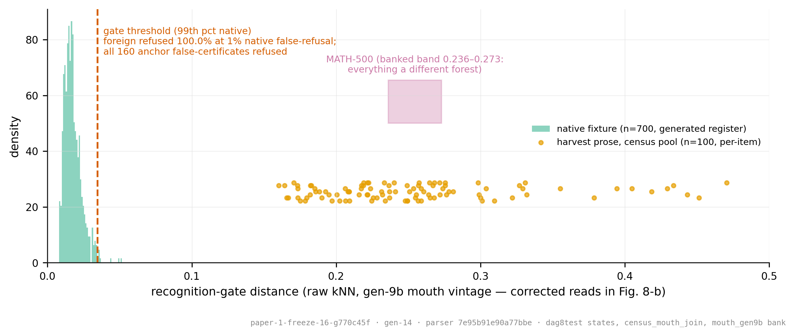
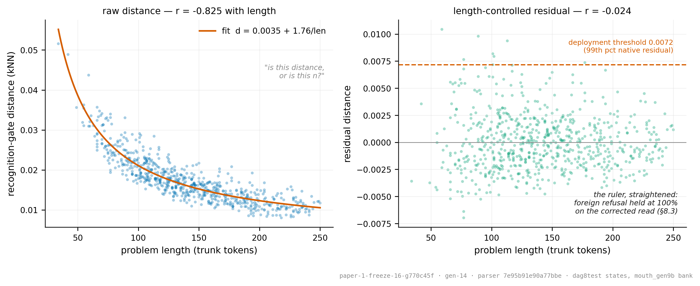
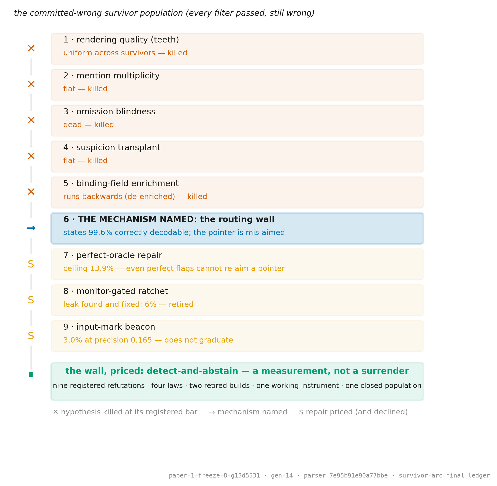
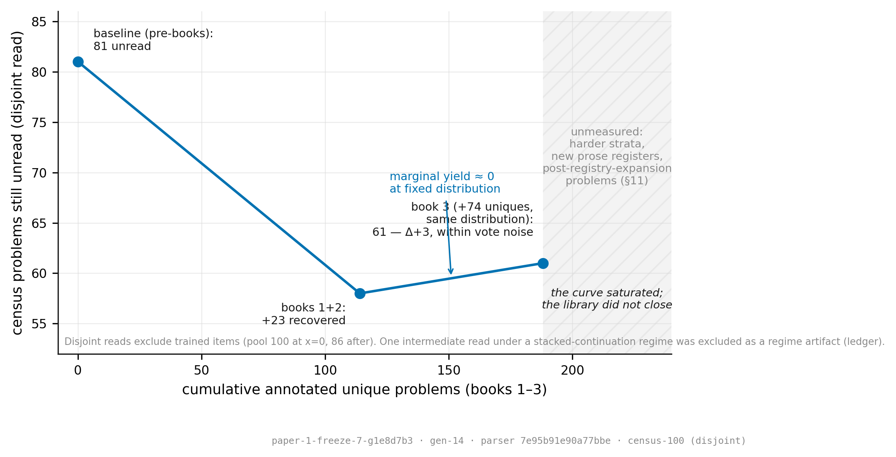

# Certify, Answer, Flag, Abstain: A Chain of Custody for Machine-Read Mathematics

## Abstract

A deployed reasoning system's output should not be an answer; it
should be a decision. We present a system that reads algebra-in-words
into typed factor graphs, solves them exactly, and emits one of four
decisions — **certify, answer, flag, or abstain** — through decision
machinery that is entirely zero-parameter: no gradient flows through
any component that produces a verdict. Behind a four-link chain of
custody (input register, rendering invariance, lineage invariance,
truth), the system certifies 912 of 1,500 held-out problems at
measured 1.0000 precision — a zero-numerator bound, reported as such.
The trained footprint is 8.0M parameters against a 506M-parameter
frozen trunk slice; verification adds zero. On foreign benchmark prose
the same channel initially certified garbage at 2% precision. We
report this at full strength, because the zero-parameter recognition
gate it forced now refuses 100% of that text: certification is
distribution-bounded, and the bound is measured, gated, and published.
A three-book hand-annotation campaign moved the reading frontier until
its yield curve measurably saturated. Everything was built under
registered predictions with mechanized verdicts across fourteen model
generations; the complete ledger ships as supplementary material, and
the paper closes with a falsifiable prediction about its own
instrument's aging.

## 1. Introduction

Deployed language models produce answers without knowing when they are
right, and the discipline's natural instinct — read the model's own
confidence — measures the wrong thing. We can state this as a
measurement rather than a position. In our system, the entropy of a
five-way vote across re-renderings of the same problem separates
*fragile* parses from *settled* ones almost perfectly; it cannot
separate settled-and-correct from settled-and-wrong (H = 0.000 versus
0.212 — the confidently wrong are nearly as quiet as the confidently
right; Figure 2). **Temperature is orthogonal to truth.** Any
architecture that ends at an internal confidence signal has built a
depth gauge and called it a compass. This paper is about what to build
instead.

The artifact is a **certification lattice** (Figure 1): a system whose
output is one of four decisions — certify, answer, flag, abstain —
produced by a chain of custody in which each link checks one
invariance the previous link cannot. A recognition gate asks whether
the input is in the register the system was calibrated on; a five-view
vote asks whether the parse survives re-rendering; a cross-lineage
panel asks whether it survives a change of training history; the
answer key — present only in measurement, never in deployment — asks
whether it is true. Every link is zero-parameter, and every link is
justified in §6 by a named specimen that defeats the chain without it.
The accountability arithmetic is §3's census: 8.0M trained parameters
leveraged against a 506M frozen trunk slice, with every component on
the verification path adding exactly zero — there is nothing on that
path for training pressure to corrupt. At freeze, the certified
channel covers 60.8% of the widest fixture at measured 1.0000
precision, with the zero-numerator arithmetic stated where the number
is (§6.2, §10).

The paper's second product is the **method**. Every substantive claim
began as a registered prediction with kill bars pinned before
measurement; promotions are performed by battery scripts that either
write the deployment manifest or touch nothing; and the complete
chronological ledger — every registration, bar, verdict, and law —
ships as supplementary material. It is long, unedited, and contains
our mistakes at the same resolution as our results; that is what makes
it evidence rather than narrative. §8 shows the discipline at full
length on the campaign's hardest problem, and §8.3 tables the laws it
yielded, several of which (instrument rotation, estimator variance
masquerading as distance, selection against promoted gates) we believe
transfer to any measurement system that watches itself.

The **construction** is a reading campaign (§9): three books of real
mathematical prose, hand-annotated through a gate the annotators could
not flatter — it rejected its own author's first five attempts — and
measured to completion: the yield curve saturated (Figure 9), the
mechanism was confirmed by three independent instruments, and the
annotation rulebook was written entirely by the parser's refusals.

The **limit** is reported at the same strength as the results. On a
public benchmark slice with no author fingerprint anywhere on its
input side, the certification channel initially signed foreign
garbage — 2% precision where it measured 1.0000 in-distribution — and
the flat abstention curve showed the system did not know what it did
not know (§7). The recognition gate exists because of that
measurement, now refuses 100% of the anchor's false certificates, and
the anchor sits permanently outside every acceptance path as the
standing examiner. We claim no benchmark competence; we claim a
certified channel whose boundary is measured, and §10 — drafted before
any other section — is the recommended first stop for a skeptical
reader: it states what the numbers do not show, including the
zero-numerator bound, the n=1-per-generation fact, and that the
annotator is the system's author.

The reader's map: §2 situates the work; §3 derives the two-jaws
architecture from the binding theorem; §4 gives the corpus discipline
(including train/test disjointness verified up to graph isomorphism);
§5 measures the repair stack to its boundary; §6 presents the lattice;
§7 the external anchor; §8 the method; §9 the reading campaign; §10
the honest limitations; contributions and author accounting close the
paper.

## 2. Related Work

Every citation below was verified against its actual source before it
was characterized, and the bibliography carries a per-entry note on
what each work is cited for — the same use-matches-source standard the
rest of the paper applies to its own numbers.

**Selective prediction and abstention.** The reject option is as old as
pattern recognition (Chow, 1957; 1970), and selective classification's
risk–coverage framing (Geifman & El-Yaniv, 2017, and successors) is the
natural coordinate system for our Figure 4. Two things distinguish
the lattice from this line. First, the decision machinery itself is
zero-parameter: nothing is trained on the accept/reject decision, so
the selective mechanism cannot be shaped by the errors it will later be
asked to catch — a property we argue for by named counterexample rather
than by taste (§6.3). Second, the abstention literature typically
evaluates a single trained model with a confidence head on one
distribution; our claim is *distribution-bounded by construction*, with
the boundary itself measured, gated, and reported as a headline result
(§7) rather than as a threat to validity.

**Calibration and internal confidence.** Post-hoc calibration
(Guo et al., 2017) and language models' verbalized or self-evaluated
confidence (Kadavath et al., 2022) all improve the *readability* of an internal
signal. Our measurement problem with this entire family is §6.1's:
vote entropy — the strongest internal signal we found — cleanly
separates fragile from settled parses and cannot separate
settled-correct from settled-wrong (H = 0.000 vs 0.212). Internal
signals read basin depth. We do not argue calibration is useless; we
argue it calibrates the wrong axis for certification, which is why the
lattice's last two links are *external* (a differently-trained sibling
and an answer key) rather than better-calibrated internals.

**Self-consistency, met head-on.** The closest relative of our vote is
self-consistency decoding (Wang et al., 2023): sample multiple
reasoning paths, take the majority. The mechanism differs in three
load-bearing ways. Our five views are deterministic, solution-preserving
*re-renderings of the input* (sentence permutations), not temperature
samples — test-time augmentation in lineage (Krizhevsky et al., 2012;
Shanmugam et al., 2021), repurposed from accuracy averaging to
certification; notably, the dedicated study of TTA aggregation found
naive averaging imperfect, and unanimity is not averaging. Agreement
here measures invariance of the *reading*, not stability of a
sampler. Unanimity is used as a certification tier with
measured precision (1.0000 on 912, zero-numerator bound stated), not as
an accuracy booster. And we report where the signal provably breaks:
on out-of-register input all views are read by the same miscalibrated
arm, agreement decouples from truth entirely (2% certified precision,
§7), and a majority-vote system without an input-register gate inherits
that failure silently. Self-consistency work generally reports the
in-distribution win; §7 is the out-of-distribution invoice.

**Conformal prediction.** Conformal methods (Vovk et al., 2005;
Shafer & Vovk, 2008; Angelopoulos & Bates, 2021) offer
distribution-free coverage guarantees, which is more than our
zero-numerator bound provides — *under exchangeability between
calibration and test data*. That precondition is precisely what our
external anchor violates and what the recognition gate exists to test:
the mouth is, functionally, an explicit exchangeability check run
before any statistical claim is trusted. We view the two approaches as
complementary — a conformal layer over the lattice's scores is natural
future work — but we note that our headline failure mode (§7.2, foreign
text certified confidently) is exactly the one a conformal guarantee
calibrated in-register would also have signed.

**Propose/dispose architectures.** The two-jaws design belongs to the
family in which a learned proposer is checked by a sound verifier:
semantic parsing of math word problems to equation forms (Zhang et
al., 2020), autoformalization into proof assistants whose downstream
proofs are machine-checkable (Wu et al., 2022), trained verifiers over
sampled solutions (Cobbe et al., 2021; process-supervised in Lightman
et al., 2023), and — in spirit — speculative decoding's
draft-then-verify asymmetry, where a cheap proposer's output is
accepted only by an exact check that preserves the target distribution
(Leviathan et al., 2023; Chen et al., 2023). The lattice differs
where §3.2's census row does: our verification path contains zero
trained parameters end to end (trained verifiers move the corruptible
component rather than removing it), and abstraction is confined to
the propose side by rule — macro-relations expand to primitives before
the solver sees anything, so the checker's soundness is never
delegated.

**Retransmission.** §5's repair stack is, deliberately, an ARQ system
(Lin, Costello & Miller, 1984): error detection (the
portfolio), negative acknowledgment (the flag), selective
retransmission of flagged fields (the specialist), and a measured
per-round recovery decay that motivates shallow retry budgets. We
import the vocabulary because the communications literature solved the
bookkeeping of *when to stop re-asking* long ago; our contribution
there is the boundary measurement (§5, §8.2), not the loop.

**Instrument aging.** Distribution shift, deployment monitoring, and
Goodhart-style dynamics — "any observed statistical regularity will
tend to collapse once pressure is placed upon it for control purposes"
(Goodhart, 1975; taxonomy in Manheim & Garrabrant, 2018) — all
describe measures and detectors degrading in deployment. What we have not found
articulated in the abstention or monitoring literatures is the
selection mechanism of §6.4 — *any signal promoted to a gate becomes
selected against, because the surviving error population is by
construction the population that passes it* — together with its design
consequence (a rotation portfolio that always holds one examiner out of
the acceptance path) and a falsifiable, pre-registered prediction of
the paper's own detector decaying. We state this novelty claim
carefully: the ingredients (Goodhart's law, adversarial drift) are
old; the articulation as a deployment law with a succession plan and a
standing bet is, to our knowledge, new.

## 3. The Architecture (two jaws, derived)

### 3.1 The binding theorem, and the design it forces

The architecture is best introduced by the negative result that shaped
it. A *concept*, in this domain, is not recoverable from either of its
two surfaces. From the language side: problems that read as obvious kin
— the taxi fare and the filling faucets of Figure 3, both creatures of
the rate frame — share no graph class; their kinship is real, measured
in the frozen trunk's own geometry (z = −2.05), and entirely absent
from their wiring. From the structure side: problems with *identical*
canonical graphs — one digest, one knot — wear surfaces so different
that no lexical method recognizes them as related. We call this the
**binding theorem**: the concept is the binding between a linguistic
frame and a structural role, and it lives in neither side alone.
Figure 3 shows the four specimens; the structure-side sweep that found
graph-twins across fixture boundaries is §4's isomorph audit, and both
directions' full measurement records are in the ledger.

The two-jaws design is this theorem applied. If concepts are bindings,
then recognition and abstraction must live where the binding is made —
on the *parse side*, in the trained components that read language into
structure. The factor graph they emit is deliberately **frame-free**:
it records variables, relations, and quantities, and forgets that the
problem was about taxis. The factor-graph representation itself is standard (Kschischang,
Frey & Loeliger, 2001); what the theorem forces is where its content
may come from. And verification inherits *neither* side: the
symbolic solver receives only the graph, searches it exactly, and is
graded by the dataset's answer key. When higher-level abstractions
enter (macro-relations proposed from recurring subgraphs), they expand
to primitives *before* the solver sees anything — the key always grades
in primitives. The slogan form: **neural proposes, symbolic disposes** —
abstraction may live in annotation and recognition, never in
verification.

### 3.2 The components at freeze, census-verified

The construction jaw is a small trained head over a large frozen eye.
The **trunk** is the embedding table and first four layers of a
pretrained 1B-parameter language model, used input-side only and never
trained. The **parser head** reads the trunk's states into a typed
factor graph through two slot banks — 24 variable slots bound to
letters positionally, 24 factor slots — with bilinear pointers from
factor arguments to variables, a six-way factor typing plus an argument
multiplicity bit, and most-significant-digit-first quantity decoding.
(The six factor types are the parse-side surface, not the relation
inventory: registry relations enter as solver-side predicates bridged
onto these types — §3.3 — which is how double-digit relation kinds ride
on a six-way head output.)
The **repair specialist** is a second head of the same architecture,
retrained each generation on the gate model's organic failures and
consulted only when the vote abstains. Around them sits the
zero-parameter decision machinery of §6 (views, votes, panel join,
recognition gate, flag), and beneath them the **solving jaw**: a
general constraint-search core (arc consistency, forced-only commits,
a predicate registry) containing zero learned parameters and zero
domain-specific code in its core.

The parameter census (Table 1), re-run at the freeze tag against the
deployed checkpoints rather than quoted from memory:

| Census row | Parameters |
|---|---|
| Trained and deployed (parser + repair specialist) | 8,005,722 |
| Trained, whole system — both jaws (the solver adds zero) | 8,005,722 |
| Frozen and leveraged (trunk: embeddings + layers 0–3) | 505,954,304 |

The second row equaling the first is the architecture's claim in
numbers: everything added to make answers *checkable* — search,
verification, certification — added nothing trainable, so there is
nothing on the verification path for training pressure to corrupt. The
leverage ratio (63× frozen per trained; 126× against the parser alone)
states the design bet: a pretrained model's early layers already carry
the reading; the trained head only learns where to point. Two sibling
heads (4.0M and 13.8M, one differing in lineage and one in width) are
additionally deployed at the certification tier as cross-examiners
(§6.2); they produce votes, never answers.

### 3.3 As-built versus as-designed

The honest paragraph. The design that survived contact is narrower and
better than the one first drawn. The predicate registry did what it was
designed to do: relations enter as a predicate plus a parse-side
bridge, with zero edits to the search core, and the registry has grown
through double-digit relation kinds that way. Two designed components
died: a hyperbolic embedding tier for the kind hierarchy was never
needed — hard membership structures (masks, slots, letter positions)
did its job with no learned geometry at all — and an elaborate
memory/notebook mechanism gave way to a plain repair signal: the vote
abstains, the specialist answers. In both cases a designed *object* was
replaced by a measured *action*. The nouns died; the verbs survived.

### 3.4 Design laws as constraints, not lore

Three regularities from the campaign function as standing constraints
on the architecture rather than commentary about it (sighting counts in
Table 2). First, the **pointer law**: pointer errors are never fixed
downstream of the pointer, so every new relation's pointer is *born*
candidate-restricted and span-supervised — the five remedies (masked
attention, span supervision, a comma, alphabetical discipline, ballast)
are a descending-cost toolkit applied at birth, not repairs applied
after. Second, the **discovered dialect**: the annotation language the
books converged on — consecutive letters, explicit knowns, one
declarative relation per sentence — was never designed; it was written
by the parser's refusals, one rule per refusal, and it now functions as
the system's intermediate representation. The one *designed* logical
form the project attempted is a tombstone (§9); the dialect that works
was discovered under selection. Third, the **two-channel spine**: the
strict separation of frame (parse-side) from structure (graph-side) was
an early architectural guess that the binding theorem later proved
load-bearing — collapse the channels and the concept has nowhere to
live except entangled in both, which is precisely the failure the
frozen trunk exhibits on its one chronic family (§10).

## 4. Corpus Discipline (how the training data cannot lie)

### 4.1 Solution-first, gate-refused

Every generated problem in this system is built backwards: a solution
is constructed first, then a graph consistent with it, then text. The
inversion is load-bearing because it makes correctness properties
*checkable at mint time* rather than hoped for downstream. Two gates
run on every candidate: a uniqueness gate (ban-and-resolve search under
a fixed decision budget, where budget exhaustion *rejects* — an item
whose uniqueness cannot be certified is not emitted) and a round-trip
gate (the emitted text must parse back to a graph whose solution
matches the one it was built from).

The design principle the gates enforce is that edge cases are made
**unrepresentable rather than handled**. Three specimens, one
principle: quadratic-family items are minted with
perfect-square-by-construction discriminants, which *dissolved* the
no-real-roots policy instead of implementing it; ill-defined selectors
(a "largest" with no unique largest) self-gate as constraint violations
and never reach text; and repeated-argument circuits carry an explicit
no-give mechanism so the givens gate cannot leak the queried value.
Three edge policies, zero new mechanisms — the generator's grammar
simply cannot say the broken thing.

### 4.2 Difficulty as measured axes, and the curriculum tombstone

Corpus difficulty is controlled by named, measured axes rather than
vibes: *teeth* (rendering wildness — how far surface forms stray from
canonical templates) and *bands* (structural depth — variables,
chain length, relation mix). Both axes exist so that claims like
"harder" have coordinates, and so that evaluation fixtures can be
stratified by construction.

One honest sentence owed here: progressive difficulty ordering — the
curriculum — is dead in this system at scale. It won its early
ablation honestly (regime-tagged as such in the ledger), then inverted
when the register mix widened: the schedule probe ran flat-mix against
staged orderings from the same warm start and flat won outright. All
training in the frozen stack is flat-mix; verdicts about orderings
expire with their regime, and this one did.

### 4.3 The grading policy, measured against itself

Before any headline number was quoted, the grading policy was made
uniform and then *audited as an instrument*. The uniform metric is
forced-answer at the query variable (solution-set equivalence, not
string match). Re-grading the then-current fixture under it: a raw 802
one-shot correct decomposed into 5 lucky-unforced answers (bounding the
old metric's luck inflation at **0.6%**) and 797 forced-correct. The
audit's real finding: **132 of 797 (16.6%) of correct answers come from
graphs that differ from gold factor-wise** — right where asked, wrong
somewhere unqueried. That ~17% equivalence class is stable across
independent corpus draws (16.6/17.2) and is treated as a design
parameter of the domain, not noise: it is why the certification chain
(§6) grades answers through the solver rather than trusting graph
match, and why "parse accuracy" and "answer accuracy" are never used
interchangeably in this paper.

### 4.4 Disjointness up to isomorphism

The audit-swarm's first question — does the test set leak into
training? — is answered here at a stricter standard than string
deduplication. Every problem is identified by a canonical
Weisfeiler-Leman digest of its factor graph (Weisfeiler & Leman, 1968;
Shervashidze et al., 2011): two problems with different letters,
different surface text, and different generators that share a knot
share a digest. WL-equivalence is coarser than exact isomorphism, so
treating digest-equal items as identical is *conservative* for this
purpose — the exclusion removes at least every true isomorph. Sweeping every fixture against every
training corpus at this standard found **42 cross-boundary isomorphs**
— items sharing a graph with something across a train/test boundary
despite sharing no text (Figure 3's bottom block shows one such pair).
They were excluded, and the check is now a *generation-bump gate*:
every promotion asserts train/test disjointness up to isomorphism
before any battery number is read. We believe this standard should be
ordinary; it is checkable in any system whose problems have canonical
structure, and it is the difference between "we deduplicated" and "we
know no knot is on both sides of the wall."

## 5. The Repair Stack and Its Boundary

The thesis of this section: **the repair stack is measured to its
boundary, and the boundary is a population, not a mystery.**

**The anomaly portfolio.** Two signals with opposite grammars watch
every accepted parse: cross-view *agreement* (a dense ranker — it
orders the whole population, best single AUC 0.840) and latent
*centroid distance* (a rare flag — nearly silent, but precise where it
fires). Their correlation is a modest 0.464, and combining them loses
whole-ranking AUC while winning at every abstention operating point
actually used (top-10% flags: kept-precision 0.862 vs 0.846) — the
metric-must-match-decision-structure law's fourth sighting, measured
inside our own registration (Table 2).

**Withhold-and-solve.** When a parse is suspect, withholding the
lowest-confidence factor and letting constraint propagation re-derive
it recovers 26% of would-be errors *for free* — zero training, and
zero silent-wrong introduced at any withhold depth, because a
re-derived value that contradicts the graph refuses rather than
guesses. This is the solver's exactness used as a repair instrument:
the deduction is only as available as the graph is redundant, and the
mechanism prices exactly that.

**Selective retransmission.** The two-checkpoint design (§3.2's parse
head and repair specialist, one frozen trunk) lets flagged *fields* be
re-asked rather than whole problems re-parsed. The clean result:
field-level structural flags beat gold text-localization as repair
conditioning — knowing *which slot* is wrong outperforms knowing which
*words* are wrong, the structural-entry law's cleanest demonstration,
with the gold-leakage bound measured at zero. At its best measured
operating point the specialist recovered 148 of 627 survivors of the
one-shot pass.

**The stack's half-life.** Repair rounds compose, and their yield
decays hard: 19.6% → 7.7% → 1.1% → 0% across four rounds — a
front-loaded shape observed four independent times (Table 2). The
stack is therefore run shallow by design; composed end-to-end it lifted
the then-current system to 47% on one domain and 32% on the other at
convergence. Nothing in the stack pretends to iterate its way through
a wall.

**The boundary.** What remains after the stack is a specific,
counted population, and its character is the finding: the survivors'
internal states are 99.6% correctly decodable — the failure is a
mis-aimed pointer, not a missing fact — and *no downstream mechanism
meaningfully re-aims a pointer* (a perfect oracle ceiling of 13.9%;
trained and input-side repairs in single digits; the arc's full
narrative and its nine registered kills are §8.2). The stack's verdict
on this population is detect-and-abstain, and its inheritance is the
prevention constraint that now governs construction: every new
relation's pointer is born candidate-restricted and span-supervised,
because the place to fix a pointer is before it is trained. The
boundary did not end the repair story; it relocated it upstream.

## 6. The Certification Lattice

> *Temperature is orthogonal to truth.*

### 6.1 The lattice as a decision structure

The system's output is not an answer; it is one of four decisions —
**certify**, **answer**, **flag**, or **abstain** — and the decision
machinery itself is zero-parameter: vote counting, unanimity checks, a
rank-sum read, an input-space distance threshold. The trained
components — the parser and its repair specialist — produce *candidate
answers*; they never produce verdicts. No parameter anywhere is trained
on the certify/answer/flag decision, and nothing in the decision path
consults the answer key: the key appears only afterward, as the grader
of the machinery, never as a component of it. It is this decision-path
purity, not an absence of learned parts, that the certification claims
rest on.

The four rungs, with their dials as first measured:

1. **Certify** — five solution-preserving re-renderings of the input
   (sentence permutations), each parsed and solved independently;
   unanimity of the five forced answers. First measured at 0.9982
   precision and 38.1% coverage.
2. **Answer** — majority vote (at least 3 of 5), with a specialist
   repair path on vote-abstain. Composite: 71.5% end-to-end at 0.833
   precision.
3. **Flag** — a rank-sum of view-disagreement and centroid distance,
   read at the tail: kept-precision 0.862 at 10% abstention.
4. **Abstain** — no forced answer anywhere.

Behind the rungs stands a chain of custody, and each link answers a
different question. The **recognition gate** asks *is this input the
kind of text the system was calibrated on?* — an input-space check,
before any parse. The **vote** asks *is the parse invariant to how the
problem is rendered?* — five retellings must produce the same answer.
The **cross-model panel** asks *is the answer invariant to which
training lineage produced the model?* — independently trained siblings
must agree. The **answer key** asks *is it true?* Register, rendering,
lineage, truth: four invariances, in that order, and the sections below
show by specimen why no link is redundant.

Why can't a confidence signal replace the chain? Because the most
natural one reads the wrong axis. Vote entropy across the five
renderings separates *shallow* parses from *deep* ones almost
perfectly — in the pilot measurement (n=36), correct-but-fragile items
read H=0.846 while deeply-settled items read near zero. But
deeply-settled and *correct* are different properties: deep-correct
items read H=0.000 and deep-wrong items read H=0.212 — the confidently
wrong are nearly as quiet as the confidently right. Entropy measures
basin depth, not truth. That is the epigraph in numbers, and it is the
structural reason the lattice ends at an external key rather than at
any internal temperature: no amount of introspective calibration
substitutes for an invariance the system cannot fake.

### 6.2 The dials at freeze

At the frozen generation, the widest fixture (1,500 held-out problems)
reads: 1195 answered correctly one-shot (79.7%); five-view unanimity
certifying at measured 1.0000 precision; and the full cross-lineage
panel — unanimity across five renderings *and* three models of distinct
training histories (one differing in lineage, one in architecture
width, with per-item behavioral disagreement measured rather than
independence assumed) — certifying **912 of 1,500 (60.8%) at measured
1.0000 precision**. Figure 4 (the precision–coverage frontier) plots every
rung: relaxing unanimity to 4-of-5 and 3-of-5 buys coverage at measured
precision cost (0.9925 and 0.9832 at first measurement), and the
frontier's history across generations shows the certification channel
widening — from 0.9982 at 38.1% coverage in its first measurement to
1.0000 at 60.8% at freeze — as the reading campaign (§9) taught the
parser the register rather than teaching it the test.

The statistical fine print is inherited from §10 and not repeated here:
1.0000 on 912 is a zero-numerator bound, not a demonstration of zero,
and 1.5% of fixture items yield fewer than five distinct renderings.
One number deserves emphasis precisely because it is *not* 1.0000: the
channel's first measurement contained a broken certificate (570 right,
1 wrong). The lattice's history includes its own counterexample, found
by the key, autopsied, and fed back into the design — which is the
intended relationship between the machinery and its failures.

### 6.3 The specimens are load-bearing

Each link in the chain of custody has a named specimen showing what
happens without it.

**The false certificate exists.** Problem [71] of the census fixture,
presented as raw prose, voted 5/5 unanimous on a wrong answer — five
renderings, one voice, wrong. This is the certification channel's
nightmare case, observed exactly where theory predicts it: on text
*outside the calibrated register*, where all five renderings are read
by the same miscalibrated arm and the vote's independence assumption
fails silently. The recognition gate exists because of this specimen —
it reads the input's register upstream of any parse, and it reads
[71]'s prose as foreign. The doorman is not decoration; it is the link
that intercepts the case the vote provably cannot.

**The second wall.** For prose that slips past the gate, the
cross-model panel provides an independent check: on the census
fixture's raw-prose items where the gate model produced stable
unanimous votes, the panel *dissented on 9 of 10* (a later generation:
16 of 19). In-register, the panel is nearly idle — the single
stable-wrong item in the 1,500-problem fixture at the generation the
panel was adopted was broken by cross-examination, 1 for 1. Its
load-bearing jurisdiction is exactly the wild register: even text that
slips the gate meets a jury drawn from a different training history.
Renderings share a model's blind spots; lineages do not.

**The quiet failure shape.** Problem [78]'s dialect voted a consistent
wrong answer across three of five views — an answer-channel error that
certifies nothing but *answers* wrongly with a stable voice. It is the
specimen for why the answer rung and the certify rung carry different
dials, and why deployment modes that cannot tolerate 0.833 must read
from the certified channel only.

### 6.4 Instruments age, by mechanism

The lattice's anomaly signals are instruments, and the campaign
measured how they age rather than assuming they don't.

The geometric monitor — per-kind centroids in the head's latent space —
lost discriminative power across generations. The audit found the
mechanism, and it was not the monitor's fault: the latent constellation
*rotates* between generations. Raw cross-generation centroid cosines
read ~0.59, as if the spaces were unrelated; after orthogonal
Procrustes alignment they read 0.988 with small residual. The
constellation's shape survives; its coordinates do not. The monitor
aged because nobody told it the sky had turned. The repair is
structural, not statistical: geometric instruments are re-anchored
every generation as a standing duty, and cross-generation geometric
comparisons are made only after alignment. (The panel is immune by
construction — its votes are answers, not coordinates.)

The deeper principle is selective. **Any signal promoted to a gate
becomes selected against**: once a signal joins the acceptance path,
the population of surviving errors is precisely the population that
passes it, and subsequent generations of failures are shaped — by
selection, not by intent — to hold their story against that signal. The
vote joined the acceptance path at the composed headline, so we
register the prediction here, in advance, that agreement-based
detection of committed-wrong parses will decline monotonically across
future generations — not because the instrument weakens but because its
population hardens. The design consequence is a rotation discipline:
**the portfolio must always hold one examiner out of the acceptance
path.** Re-rendering held that seat until the vote was promoted; at
freeze the seat belongs to the external anchor — a held-out fixture of
foreign benchmark prose, graded only by the answer key and never part
of any training or acceptance decision — with unselected-against
candidates staged for the next rotation (a library cross-check that has
never joined acceptance; genuinely new view families such as paraphrase
re-renders). We believe this is why anomaly detectors age in deployed
systems generally, and the lattice is designed around the expectation
rather than surprised by it.

## 7. The External Anchor (the wound, the funnel, the cure)

### 7.1 The one number with no author fingerprint

The anchor is a fixed slice of a public competition benchmark — the
MATH dataset (Hendrycks et al., 2021), via the 500-problem test subset
introduced by Lightman et al. (2023) and commonly called MATH-500 —
acquired labeled, measured, and never trained on. It is the
only measurement in this paper whose *inputs* carry no author influence
of any kind: every other fixture is either machine-generated by our
generators or hand-annotated by us, gated however incorruptibly. The
anchor's problems were written by strangers, selected by strangers, and
graded by their published answers. That is why the paper treats it as
the examiner rather than the exam — and why this section reports the
examiner's verdict first and the repair second, in that order, at full
strength.

### 7.2 The wound, as registered

Three predictions were pinned before the anchor ran. The coverage
prediction held (the answerable slice was small, as expected). The
other two were refuted, and the refutations are the section's content.
On the slice where certificates were possible, certified precision was
**2/97** — the same channel measured at 1.0000 in-distribution signed
foreign garbage confidently — and the lattice issued **63 certificates
on non-integer-answer problems where zero were possible**. Worse,
abstention was *flat* across strata (67.5% vs 66.1%): the system did
not know what it did not know.

The mechanism is visible in the vote counts and is the section's
theorem. On foreign text the parser mis-reads *stably*: all five
renderings are read by the same arm, whose bias off-distribution is
systematic rather than random, so sentence permutation decorrelates
template variation but not distributional confusion. **Unanimity
certifies reading stability, and stability coincides with truth only
in-distribution.** Every signal in the decision portfolio — agreement
included — is calibrated on the training distribution, and
out-of-distribution input breaks the seal silently. The honest sentence,
exactly as it entered the ledger: *on foreign text the lattice
certifies stability, not correctness — the certification claim is
distribution-bounded, and the anchor measured exactly where the bound
lies.* This was the campaign's most valuable measurement, not a
deployment incident: the anchor was designed as the held-out examiner,
and it found the missing organ on first contact.

### 7.3 The cure: input validation at the mouth

The system, viewed as a funnel, had every stage a production pipeline
has — a form (the parser), a schema (the registry), a database with
referential integrity (the solver) — except the one every production
form has: **input validation**. The checks below the mouth validate the
graph's consistency, never whether the form was filled in a language
the reader speaks.

The recognition gate is that validation, and it is deliberately
zero-parameter: pooled trunk-state distance to the training families,
a kNN read with a calibrated threshold, no trained component anywhere
(input-space OOD is selection-safe — no training pressure shapes errors
against a gate that no gradient flows through). Measured on the banked
populations: AUC 1.0000 on both scores; **foreign text refused 100.0%
at 1% native false-refusal; and all 160 of the anchor's false
certificates refused at the threshold**. Figure 5 maps every population
against the gate's ruler. The lattice behind the gate now signs nothing
it cannot read.

The gate then earned its own §10 entry, which we report as part of the
result. Its distance estimator pooled variable-length evidence and
thereby inherited a sample-size coordinate — within-register distances
correlated with text length at r = −0.825, an instrument warp found by
a registered audit four days after deployment. The correction (a 1/length
residualization, fit on native text) took the confound to −0.024
(Figure 6, both panels from the banked per-item reads), and
the recalibrated read *confirmed the wall on a straight ruler*: the
foreign refusal held at 100% length-controlled, and the harvest
zero-point re-read at 0.1871 (from a warped 0.243). Every mouth reading
in this paper is the corrected vintage; the battery asserts the
correction's presence rather than trusting anyone to remember it.

### 7.4 The gradient, honestly, and the constructive close

What the mouth sees beyond the wall is reported at its true faintness.
The whole benchmark reads *foreign* in a narrow band (0.236–0.273
against a native threshold of 0.044 raw) — everything is a different
forest, and leaf-level gradation is unanswerable at that distance. The
ordering that does exist inverts intuition: the *symbol-dense* subjects
read nearest and natural-prose subjects farthest, because the system's
native register — terse, symbol-dense fact-sentences — is closer to
LaTeX-heavy text than to conversational prose. The logged hypothesis,
open: the language gap is prose *style* before it is relation
vocabulary, which reorders the coverage roadmap (paraphrase-robustness
before new relation types).

The demand side was also censused before any build: 62.2% of the
benchmark has plain-integer answers, and its subject mix prices the
registry expansion the successor campaign requires. §10's boundary
holds unchanged — no benchmark competence is claimed here. What §7
claims is the pairing: **recognition buys honesty now; coverage buys
capability later.** The funnel got its mouth first; the mouth learns
more languages next; and the anchor stays seated where §6.4 put it —
the standing examiner outside every acceptance path, waiting for the
next generation with the same indifference it showed this one.

## 8. The Method (registered predictions, mechanized verdicts)

### 8.1 The protocol

Every substantive claim in this paper began as a *registered
prediction*: an expected outcome, its kill bars, and the frame for
reading a mixed result, all pinned in a chronological ledger before the
measurement ran — preregistration and registered reports (Chambers,
2013; Nosek et al., 2018), adapted from the empirical sciences to an
engineering campaign. Three rules give the registration teeth. First,
**bars before builds** — a mechanism is not evaluated by whether it
seems to help but by whether it clears a number chosen when we did not
yet know the answer; a result between the bars is read by the
pre-pinned frame, not by post-hoc preference. Second, **density regimes
stated** — a prediction about error populations must declare which
population it samples (multi-error or single-error, survivor-selected
or raw), because five separate times an unexamined population turned a
correct-sounding prediction wrong. Third, **promotions are mechanical**
— a generation is promoted by a battery script that checks every bar
and either writes the deployment manifest and prints PROMOTED, or
prints the kill and touches nothing. The word and the write are one
atomic act; there is no state of the system that exists only in prose.
(The rule earned its name — *prose promotions don't move machines* —
when an audit found the manifest four generations stale behind a sprint
of prose-only promotions; the audit is in the ledger, and the rule has
held since.)

The ledger itself ships as supplementary material. It is long,
unedited, and contains our mistakes at the same resolution as our
results; that is what makes it evidence rather than narrative.

### 8.2 The worked example: the survivor arc

The method is best shown at full length on the campaign's hardest
problem. After the parser converged, a population of *committed-wrong*
parses remained — confidently accepted, wrong, and surviving every
filter in the stack. The temptation such a wall offers is a story; the
protocol requires a sequence of registered kills instead. Nine
refutations ran in order (Figure 7), each a named hypothesis with a
pinned bar: rendering quality was uniform across survivors; mention
multiplicity was flat; omission blindness was dead; the suspicion
transplant was flat; binding-field enrichment ran backwards. The sixth
step named the mechanism — the survivors' internal states were **99.6%
correctly decodable**, with the failure isolated in a mis-aimed pointer
(the routing wall) — and the last three priced it: a *perfect oracle*
flagging every wrong field repaired only 13.9%; a monitor-gated
self-repair ratchet leaked, was fixed, and bought 6%; input-mark
beacons bought 3.0% at precision 0.165. The arc's closing accounting is
the method in one line: **nine registered refutations, four laws, two
retired builds, one working instrument, one closed population.**

The verdict — this population is detect-and-abstain under current
machinery — is a measurement, not a surrender, and it did the work a
story could not: it retired two speculative build programs before they
consumed the campaign, produced the anomaly monitor as a by-product,
and wrote the prevention constraint that governed everything after
(every new relation's pointer is born with candidate restriction and
span supervision, because pointer errors are never fixed downstream —
five sightings). A reader who follows this one arc tombstone by
tombstone has seen the entire method; every other chapter in the ledger
runs the same shape at smaller scale.

### 8.3 The yield: laws with sighting counts

The protocol's recurring product is not accuracy but *laws* — failure
modes and design constraints observed repeatedly enough, or with
mechanism enough, to govern future builds. Table 2 lists the working
set; full forms and every sighting citation are in the ledger. The
forms travel; the constants do not (§10).

| Law (short form) | Sightings | Note |
|---|---|---|
| Metrics must match the decision structure they serve | 4 | 4th was inside our own registration (AUC vs tail abstention) |
| Pointer errors are never fixed downstream of the pointer | 5 | 1st at training, 5th at inference |
| Predictions must state their density regime / population | 5 | unexamined populations flip verdicts |
| Repair recovery is front-loaded; round 4 ≈ 0 | 4 | independent sightings across domains |
| A selection criterion's jurisdiction is the property it selects on | 3 | "survived filter X" ≠ repairable |
| Acceptance criteria must be measured, not assumed | 3 | third confirmation closed the beacon |
| Binding enters as structure (masks, spans, letters), never as prose | 2+ | the pointer law's five remedies, descending cost |
| Prevention beats repair for confident wrongness | 2 | representational pressure, not decode-side fixes |
| Prose promotions don't move machines | 1 + audit | the stale-manifest finding; rule mechanized |
| Estimator variance masquerades as distance | 1 + mechanism | length correction r = −0.825 → −0.024 |
| Latent drift is rotation, not decay — align or re-anchor | 1 + mechanism | Procrustes 0.59 → 0.988 (Figure 8) |
| Any signal promoted to a gate becomes selected against | 1 + prediction | the standing bet, §6.4 |
| Temperature is orthogonal to truth | 1 + mechanism | vote entropy reads depth, not correctness (Figure 2) |

### 8.4 The method applied to itself

The discipline's credibility rests on what it caught in its *own*
instruments. Three defects were found and corrected by the same
registered-audit machinery that measures the system (§10): the
length-biased pooling estimator, the rotated monitor coordinates, and
the diet-shaped temperature calibration. Each audit followed the same
pattern — a registered discriminating test whose outcomes were pinned
to different mechanisms before the read (for the monitor: *re-anchor
and re-measure; recovered AUC means rotation was the whole story;
still-degraded means selection-hardening on top*). Instruments here are
treated as trained-adjacent objects that age with the system they
watch; recalibrating the watchers is a standing per-generation duty,
and the succession plan for the one examiner held out of the acceptance
path is published in §6.4.

### 8.5 The workflow, honestly

The campaign ran as two channels and an adjudicator. One channel
(Claude) designed and registered: predictions, bars, reading frames,
and adversarial critique. A second channel (Claude) built and measured:
implementations, batteries, the ledger, this paper. The human author
directed and adjudicated: every training run fired on his explicit
word, every promotion was his to accept, and twenty times during the
campaign he registered a pre-verbal instinct — "we are missing
something about hash collisions," "about key-value pairs," "about
palindromes" — that was formalized into an audit before measurement.
All twenty audits found something real. We report the streak not as
testimony to intuition but as a product of the discipline that made it
*checkable*: an instinct that had to survive formal registration and a
mechanical read is data; the same instinct applied directly to the
system would have been anecdote.

The method's last exhibit is the bet it places on itself: §6.4's
registered prediction that our own certification instrument will age,
with its replacement already seated. A method that expects to be wrong
in specified ways, in public, is the strongest form of confidence we
know how to state.

## 9. The Reading Campaign (the library and the librarian)

§8 showed the discipline killing hypotheses; this section shows it
building something. The campaign's object was the register wall of §7:
real mathematical prose, written by strangers, that the system could
not read. Its instrument was annotation — three books of hand-written
dialect translations of real training-split problems — passed through
a gate the annotator cannot flatter. Its results are five measured
beats.

**The economics.** Problems classify into three lanes by what they
need: machine-bankable as-is (~1%), repairable by the specialist under
the vote (~16.5%), and full hand surgery (~82.5%) — rates stable
between the census pool and wild samples (a 400-problem draw
classified 4/66/330), which made the campaign's cost forecastable from
its first week. When a later, stronger gate re-classified the wild
pool, the repair lane had grown from 16.5% to 35% at surgery's expense
— the recipe book doing its work — so the lane split is not a constant
of the domain but a moving readout of how much the librarian has
learned. Throughout, the census fixture itself was never annotated:
the measuring stick never became substrate.

**The gate, demonstrated on its authors.** The gate is five-rendering
unanimity plus the dataset's published answer, mechanically applied —
and its first day is the §10 annotator-paragraph made concrete: the
author's first five seed annotations were **all rejected, zero banked**,
and the zero was the system working. The rejections were diagnostic
(the human's dialect was out of distribution — miniature problems,
out-of-range values — and the parser's bindings wobble exactly there),
and the fixes they forced became annotation policy. The gate went on
to catch its authors three more times, rejecting annotations whose
values silently exceeded the solver's domain ([32], [220], and [113] —
the last having stood for days as a suspected model failure before the
audit unmasked it as our error). A gate that cannot be flattered by
its own builders is the campaign's license to call its data gold.

**The rulebook, written by refusals.** The campaign's one attempt to
*design* its intermediate language top-down died in a registered kill
early in the project; the dialect that works was written bottom-up,
one refusal at a time. Every rule in the annotation rulebook is a
named wall the parser refused at: scattered variable
letters produced the consecutive-letters rule; out-of-domain values
produced the in-band rule; chained floor-division produced the
one-fdiv rule and the multiplicative-inverse routing recipe;
frame-entangled prose produced the frame-strip flags. The operational
signature of the mature campaign is its **mystery half-life**: from
book 2 onward, every refusal resolved into exactly one of three
buckets — a recipe, a registry certificate, or an annotator error —
within a single tranche. Nothing stayed mysterious for longer than one
working session, and the buckets are counted, not remembered.

**The mechanism, triple-confirmed.** That the books work is claim 3;
*how* they work was confirmed by three independent instruments.
As register teacher: the mouth's odometer moved **+31.1%** relative
(0.1871 → 0.1288, length-controlled, straight-to-straight vintages)
and the disjoint census moved +8 problems per ~100 annotated rows at
the pinned bar. As regularizer: at 2.9% share and ten repetitions per
unique, the prose gradient *regularized* the dialect fixture — a record
on the generated benchmark arrived as a side effect — while the same
prose at saturation dose was poison (−243), so the dose law, not the
data, carries the effect. As positional rehearsal (in the interference-mitigation sense:
McCloskey & Cohen, 1989; French, 1999): naturally varying
prose paid a calibration debt no generator had — small-graph vote
entropy closed from 0.212 to 0.010, a prediction pinned before the
training run that printed it. Three effects, three instruments, no
shared failure mode.

**The completion.** The campaign then measured its own end: Figure 9's
saturation curve (~23 census problems recovered for the first ~114
annotated uniques, ~0 marginal for the next 74 at the same
distribution — with the §10 scope drawn on the plot). The registry's
waiting room emptied the same way: the problem that had been chronic
across three generations ([7], a rate problem with a trunk-geometry
birth certificate) banked as routine plumbing under the final gate, and
the campaign closed with its confirmed-structural population at zero
pending the volume census — every wall had become a recipe, a
certificate, or plumbing, and the one candidate that may remain is
named in §10. The books did not just teach the parser to read; they
re-tempered its pointers, regularized its dialect, and wrote their own
rulebook. The library taught the librarian.

## 10. Honest Limitations

*(Drafted first, per the method: a paper whose spine is calibration must
lead with what it cannot claim.)*

**Scope of register.** Every capability this paper certifies lives in one
language family: algebra-in-words over integer-valued factor graphs with
values in 0–300. At freeze, the deployed generation's own battery reads
that register at 1195/1500 one-shot on its widest fixture and certifies
at measured 1.0000 precision — and answered roughly 2% of *foreign*
benchmark prose correctly (the measurement that motivated the recognition
gate). The recognition mouth exists precisely because this boundary is
sharp: the system refuses what it cannot read, and the refusal is the
product. MATH-500 competence is explicitly not claimed here; it is the
subject of the successor campaign (Paper II), and this paper's
certification results are independent of it.

**The frontier is counted, not conquered.** After three annotated books
and fourteen model generations, 58 of the 86-problem disjoint census
fixture remain unread (the freeze generation's own read is 61; the
difference of 3 is within vote noise). This residue is not mysterious:
it is family-sorted and priced. Within the fixture: relation families
awaiting registry expansion (primality, gcd/lcm, logarithms, exponent
laws — each a counted certificate pile), negative and fractional
domains, and one suspected structural mechanism — chained
floor-division, whose founding specimen was later resolved by an
annotation rewrite, leaving a single surviving refusal and an open
question of whether the boundary is mechanistic or notational. Separately
and harvest-wide, a counted value-range family bounds the domain: 75 of
1,743 harvested problems (4%) have answers above the solver's 0–300 cap;
raising the cap was evaluated and declined at that demand. The one
chronic frame-entanglement family measured at the frozen trunk
(z = −2.05) partially dissolved under a clean-ancestry retrain; its
residual expression is bounded but its mechanism (surface/structure
entanglement in the pretrained representation) is a real limit of the
frozen-trunk design.

**Saturation is measured for one distribution only.** The reading
campaign's yield curve — 23 census items recovered for the first ~114
annotated uniques, ~0 for the next 74 at the same problem distribution —
measures the completion of *this* slice's teachable content. It does not
establish that annotation is exhausted: harder strata, new prose
registers, and post-registry-expansion problems are different
distributions with unmeasured curves. The curve saturated; the library
did not close.

**The annotator is the system's author.** The books' gold annotations
were hand-written by the system's builders, not by independent
annotators. Two design choices bound what this could corrupt: every
annotated item is graded by the symbolic solver against the dataset's
own answer key before it enters training (an oracle the annotator cannot
flatter — a wrong or leading annotation that changes the answer is
rejected mechanically), and a hand-quota rule separately bounds the
machine lane's self-preference at half of any book. But the answer key
verifies *correctness*,
not *representativeness*: the annotation style, the vocabulary of
explicitation, and the choice of which refusals to repair all carry the
authors' hands. "Gold" in this paper means author-written and
answer-verified, and a reader should weight the generalization claims
accordingly.

**Statistical honesty on the headline.** Certification precision of
1.0000 on 912 items is a zero-numerator result: it bounds the error rate
near a tenth of a percent; it does not demonstrate zero. The structural
claim — that unanimity across renderings and training lineages, behind
an input-register gate, produces a channel whose failures are rare and
mechanistically characterized — is the claim. Additionally, 23 of 1,500
fixture items (1.5%) yield fewer than five distinct permutation views
(the effective-K fine print); all certified correctly, but their
certificates rest on 3–4 effective views rather than five.

**Every generation comparison is a single training run.** No
generation was trained twice under different seeds; every
gen-N-versus-gen-N+1 delta in this paper is an n=1 comparison with no
error bar. The discipline mitigates without curing: pass bars were
pinned before each measurement, verdicts read multiple independent
fixtures, and every mechanism claim required confirmation by at least
two independent instruments before it was recorded. But seed variance
was never measured, and a reader should treat individual deltas as
observations under a registered protocol, not as estimates with known
variance.

**Instruments age, including ours.** Every geometric instrument in this
system was calibrated in some generation's latent space, and the audit
trail records three instrument defects found and corrected during the
campaign itself: a length-biased pooling estimator (r = −0.825 within a
single register before correction, −0.024 after), coordinate rotation
across generations (raw centroid cosine 0.59, Procrustes-aligned 0.988),
and softmax temperature calibrated only where the training diet placed
mass (small-graph entropy 0.212 vs 0.003 across lineages, closed to
0.010 by the books themselves). We report these because the method's
central artifact is the audit discipline, and a reader should expect
undiscovered members of the same families.

**Scale.** All results were produced on a single consumer GPU with a
4.0M-parameter trained head (8.0M with its repair specialist) over a
frozen ~506M-parameter, 4-layer trunk slice (the census re-run at the
freeze tag; §3). We make
no claim that the certification architecture transfers unchanged to
larger models, longer contexts, or richer mathematics; we claim that at
this scale, with these instruments, every number above was gated by
machinery that could not be flattered — and that the machinery, not the
numbers, is the contribution.

## Contributions

*(The paper's claim registry: five claims, each with its evidence
pointer and its limit. Nothing is claimed here that is not banked in
the ledger and gated by machinery that could not be flattered.)*

**1. A zero-parameter certification lattice whose every link is
justified by a named failure.** The system's output is a decision —
certify, answer, flag, or abstain — produced by a chain of four
invariance checks (input register, rendering, training lineage, truth)
in which no parameter is trained on the verdict and the answer key
never enters the decision path (Figure 1; §6). At freeze it certifies 912
of 1,500 held-out problems (60.8%) at measured 1.0000 precision. The
design argument is not that the chain is elegant but that it is
*minimal*: each link is motivated by a named specimen that defeats the
chain without it — a unanimous-wrong vote on foreign prose for the
recognition gate, nine-in-ten panel dissent on gate-stable wild text
for the cross-lineage panel, a broken certificate for the key. *Limit
(§10):* 1.0000 on 912 is a zero-numerator bound near a tenth of a
percent, not a demonstration of zero, and the register it holds on is
one language family.

**2. The method as artifact: a registered-prediction discipline that
survives contact with its own instruments.** Every substantive claim in
this paper was a prediction pinned before its measurement, with kill
bars that wrote the verdict mechanically — a promotion and its manifest
entry are one atomic act, and a kill touches nothing. Across fourteen
model generations this discipline converted every refutation into a
law, an instrument, or a retired build (the survivor arc alone banked
nine tombstones, §8.2), and it caught three defects in our own
instruments before a reviewer could (§10). The complete chronological
ledger — every registration, bar, verdict, and law — ships as
supplementary material: the record is offered for audit, not trust.
Its live exhibit is §6.4's standing bet: a falsifiable, pre-registered
prediction that our own agreement-based detection will decay across
future generations, published with the succession plan for its
replacement. *Limit (§10):* every generation comparison is a single
training run; the discipline bounds self-deception, not seed variance.

**3. The reading campaign: annotation with an incorruptible gate, a
confirmed mechanism, and a measured completion.** Three hand-annotated
books of real mathematical prose (~188 unique problems, ~82% requiring
full surgery) taught the parser its register through a gate the
annotator cannot flatter: five-rendering unanimity plus the dataset's
own answer key, mechanically applied. The campaign's effect has a
triple-confirmed mechanism — prose as register teacher, as regularizer
(a record on the dialect fixture arrived as a side effect), and as
positional rehearsal (small-graph vote entropy 0.212 → 0.010) — and,
unusually, a measured end: the yield curve saturated (~23 census items
for the first ~114 uniques, ~0 marginal thereafter at fixed
distribution), so the campaign reports its own completion rather than
an open slope. *Limit (§10):* saturation is measured for one
distribution; the annotator is the system's author, and the key
verifies correctness, not representativeness.

**4. The binding theorem: concepts live in neither language nor
structure, and the architecture follows.** The campaign's central
negative result, proved from both directions: problems that read as
kin on the surface share no graph class (the frame families), and
recurring graph classes recover no surface kinship (the miner's
census) — the concept is the *binding* between a linguistic frame and
a structural role, irreducible to either side. The constructive
consequence is the two-jaws design itself: recognition and abstraction
live parse-side, the factor graph is frame-free, and verification
never inherits either (§3). *Limit:* demonstrated within one register's
family structure; the theorem's reach beyond it is a conjecture the
successor campaign tests.

**5. An instrument-aging field manual, transferable beyond this
system.** Three results about measurement itself, each with mechanism:
latent-space drift across model generations is *rotation, not decay*
(raw centroid cosine 0.59, Procrustes-aligned 0.988 — re-anchor,
don't retire); pooled variable-length evidence inherits a sample-size
coordinate that masquerades as distance (a length correction took the
confound from r = −0.825 to −0.024); and any signal promoted to a gate
becomes selected against, so a monitoring portfolio must always hold
one examiner out of the acceptance path (§6.4). We offer these as
engineering laws for any deployed system that watches itself with
trained instruments. *Limit (§10):* all three were established at this
paper's scale and instrument family; the laws' forms travel, the
constants do not.

---

### Author contributions

This paper had two authors, working as two machine channels and a
human adjudicator (§8.5); the accounting below is the byline's
justification.

**Bryce Roche (human).** Direction and adjudication: every training run
fired on his word, every promotion and kill was his to accept, and the
campaign's course corrections were his calls. Twenty registered
instincts — pre-verbal hunches about where the system was wrong,
each formally registered and audited before measurement — of which
every one located a real finding (the collision audit, the latent
rotation, the length estimator, the KV smearing among them). Annotation
surgery on the books alongside the machine lanes. The authorship policy
itself.

**Claude (Anthropic; two channels).** A *design channel* that wrote
registrations, pinned prediction frames and kill bars before
measurements, and supplied adversarial critique of its sibling's
enthusiasm; and an *execution channel* that built every component,
ran every measurement, kept the ledger, and drafted this paper. The
channels checked each other: designs were built only after critique,
results were banked only through the verdict machinery.

**The machinery (neither author).** Every capability claim was gated by
scripts that write the manifest on pass and touch nothing on fail.
Neither author could flatter a number past the battery; several times
(§10) the battery refused the authors' expectations, and those
refusals are in the ledger unedited. We consider this the paper's
strongest authorship statement: the results belong to a discipline,
not to a hand.

## References

*(Every entry verified against its source; per-entry "cited for" notes in bibliography.md.)*

- Angelopoulos, A. N., & Bates, S. (2021). A Gentle Introduction to Conformal Prediction and Distribution-Free Uncertainty Quantification. arXiv:2107.07511.
- Chambers, C. D. (2013). Registered Reports: A new publishing initiative at Cortex. Cortex, 49(3), 609–610. doi:10.1016/j.cortex.2012.12.016. [Editorial.]
- Chen, C., Borgeaud, S., Irving, G., Lespiau, J.-B., Sifre, L., & Jumper, J. (2023). Accelerating Large Language Model Decoding with Speculative Sampling. arXiv:2302.01318.
- Chow, C. K. (1957). An Optimum Character Recognition System Using Decision Functions. IRE Transactions on Electronic Computers, EC-6(4), 247–254.
- Chow, C. K. (1970). On Optimum Recognition Error and Reject Tradeoff. IEEE Transactions on Information Theory, IT-16(1), 41–46. doi:10.1109/TIT.1970.1054406.
- Cobbe, K., Kosaraju, V., Bavarian, M., et al. (2021). Training Verifiers to Solve Math Word Problems. arXiv:2110.14168.
- French, R. M. (1999). Catastrophic forgetting in connectionist networks. Trends in Cognitive Sciences, 3(4), 128–135. doi:10.1016/S1364-6613(99)01294-2.
- Geifman, Y., & El-Yaniv, R. (2017). Selective Classification for Deep Neural Networks. NeurIPS 2017, 4878–4887. arXiv:1705.08500.
- Goodhart, C. A. E. (1975). Problems of Monetary Management: The UK Experience. In Papers in Monetary Economics, Vol. I, Reserve Bank of Australia. Reprinted in Goodhart, Monetary Theory and Practice, Macmillan, 1984.
- Guo, C., Pleiss, G., Sun, Y., & Weinberger, K. Q. (2017). On Calibration of Modern Neural Networks. ICML 2017, PMLR 70, 1321–1330. arXiv:1706.04599.
- Hendrycks, D., Burns, C., Kadavath, S., Arora, A., Basart, S., Tang, E., Song, D., & Steinhardt, J. (2021). Measuring Mathematical Problem Solving With the MATH Dataset. NeurIPS 2021 Datasets and Benchmarks. arXiv:2103.03874.
- Hendrycks, D., & Gimpel, K. (2017). A Baseline for Detecting Misclassified and Out-of-Distribution Examples in Neural Networks. ICLR 2017. arXiv:1610.02136.
- Kadavath, S., Conerly, T., Askell, A., et al. (2022). Language Models (Mostly) Know What They Know. arXiv:2207.05221.
- Krizhevsky, A., Sutskever, I., & Hinton, G. E. (2012). ImageNet Classification with Deep Convolutional Neural Networks. NeurIPS 2012, 1097–1105. doi:10.1145/3065386 (CACM reprint).
- Kschischang, F. R., Frey, B. J., & Loeliger, H.-A. (2001). Factor Graphs and the Sum-Product Algorithm. IEEE Transactions on Information Theory, 47(2), 498–519. doi:10.1109/18.910572.
- Leviathan, Y., Kalman, M., & Matias, Y. (2023). Fast Inference from Transformers via Speculative Decoding. ICML 2023, PMLR 202. arXiv:2211.17192.
- Lightman, H., Kosaraju, V., Burda, Y., et al. (2023). Let's Verify Step by Step. ICLR 2024. arXiv:2305.20050.
- Lin, S., Costello, D. J., Jr., & Miller, M. J. (1984). Automatic-repeat-request error-control schemes. IEEE Communications Magazine, 22(12), 5–17.
- Manheim, D., & Garrabrant, S. (2018). Categorizing Variants of Goodhart's Law. arXiv:1803.04585. [Unrefereed.]
- McCloskey, M., & Cohen, N. J. (1989). Catastrophic Interference in Connectionist Networks: The Sequential Learning Problem. Psychology of Learning and Motivation, 24, 109–165. doi:10.1016/S0079-7421(08)60536-8.
- Nosek, B. A., Ebersole, C. R., DeHaven, A. C., & Mellor, D. T. (2018). The preregistration revolution. PNAS, 115(11), 2600–2606. doi:10.1073/pnas.1708274114.
- Shafer, G., & Vovk, V. (2008). A Tutorial on Conformal Prediction. Journal of Machine Learning Research, 9, 371–421. arXiv:0706.3188.
- Shanmugam, D., Blalock, D., Balakrishnan, G., & Guttag, J. (2021). Better Aggregation in Test-Time Augmentation. ICCV 2021. arXiv:2011.11156.
- Shervashidze, N., Schweitzer, P., van Leeuwen, E. J., Mehlhorn, K., & Borgwardt, K. M. (2011). Weisfeiler-Lehman Graph Kernels. Journal of Machine Learning Research, 12, 2539–2561.
- Vovk, V., Gammerman, A., & Shafer, G. (2005). Algorithmic Learning in a Random World. Springer.
- Wang, X., Wei, J., Schuurmans, D., Le, Q. V., Chi, E. H., Narang, S., Chowdhery, A., & Zhou, D. (2023). Self-Consistency Improves Chain of Thought Reasoning in Language Models. ICLR 2023. arXiv:2203.11171.
- Weisfeiler, B., & Leman, A. A. (1968). A reduction of a graph to a canonical form and an algebra arising during this reduction. Nauchno-Technicheskaya Informatsiya, Ser. 2, 9, 12–16. [English translation available.]
- Wu, Y., Jiang, A. Q., Li, W., Rabe, M. N., Staats, C., Jamnik, M., & Szegedy, C. (2022). Autoformalization with Large Language Models. NeurIPS 2022, 32353–32368.
- Zhang, D., Wang, L., Zhang, L., Dai, B. T., & Shen, H. T. (2020). The Gap of Semantic Parsing: A Survey on Automatic Math Word Problem Solvers. IEEE TPAMI, 42(9), 2287–2305. doi:10.1109/TPAMI.2019.2914054.
